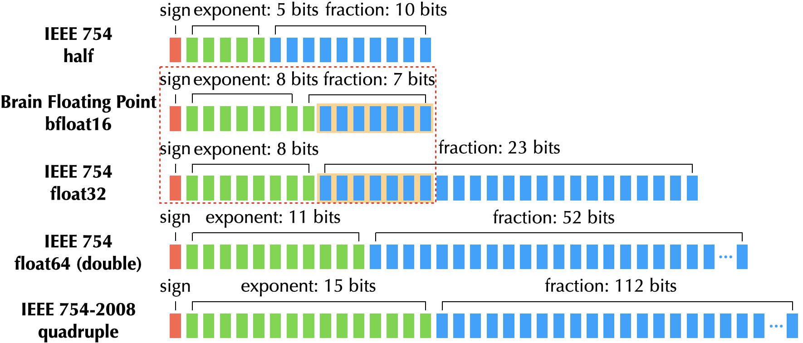
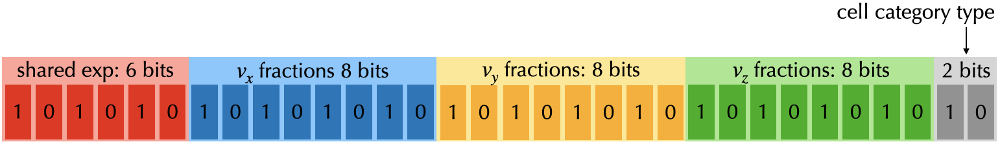
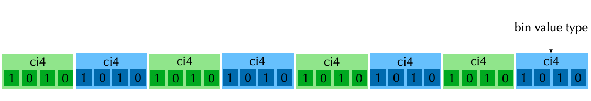

# Use quantized data types

High-resolution simulations can deliver great visual quality, but are often limited by the capacity of the onboard memory, GPU memory in particular.

To help reduce the memory footprint of your programs, Taichi provides quantized data types, aka low-precision data types. It allows you to define your own integers, fixed-point numbers, or floating-point numbers with arbitrary number of bits that work best with your limited memory capacity. At the same time, Taichi provides a suite of tailored optimizations to ensure that the runtime performance with quantized data types is comparable to the performance with full-precision data types.

:::note
For now, quantized data types are supported only on the CPU and CUDA backends.
:::

## Quantized data types

Taichi supports the following quantized data types:

- Quantized integers
- Quantized fixed-point numbers
- Quantized floating-point numbers

### Quantized integers

Quantized integers in Taichi are represented in the [two's complement](https://en.wikipedia.org/wiki/Two's_complement) format but can contain arbitrary number of bits.

- To define a 10-bit signed integer type:

```python
i10 = ti.types.quant.int(bits=10)  # `signed` is set to `True` by default
```

- To define a 5-bit unsigned integer type:

```python
u5 = ti.types.quant.int(bits=5, signed=False)
```

### Quantized fixed-point numbers

The core idea of [fixed-point numbers](https://en.wikipedia.org/wiki/Fixed-point_arithmetic) is that, if a specific range is evenly divided into multiple scale units, then a real number within that range can be approximated and represented by multiplying the value of each scale unit by an integer number. Here's an example explaining what the *scale unit* here is: If you wish to represent a real number within [0, 100] in 10 binary bits, then each *scale unit* equals 100/2<sup>10</sup> &asymp; 0.098.

Taichi allows you to define quantized fixed-point types of less than 64 bits and with an arbitrary scale unit.

- To define a 10-bit signed fixed-point type within the range [-20.0, 20.0]:

```python
fixed_type_a = ti.types.quant.fixed(bits=10, max_value=20.0)  # `signed` is set to `True` by default
```

- To define a 5-bit unsigned fixed-point type within the range [0.0, 100.0]:

```python
fixed_type_b = ti.types.quant.fixed(bits=5, signed=False, max_value=100.0)
```

- To define a 6-bit unsigned fixed-point type within [0.0, 64.0]:

```python
fixed_type_c = ti.types.quant.fixed(bits=6, signed=False, scale=1.0)  # `scale` is a predefined scaling factor
```

> Set either `scale` or `max_value`, and Taichi works out the other based on your setting. Do *not* set both.
> `max_value` is a more commonly used parameter, because you may already know the range of the number to represent.

### Quantized floating-point numbers

A [floating-point number](https://en.wikipedia.org/wiki/Floating-point_arithmetic) comprises exponent bits, fraction bits, and a sign bit. There are various floating-point formats:



Taichi allows you to define a *quantized floating-point number* with an arbitrary combination of exponent bits and fraction bits (the sign bit is made part of the fraction bits).

- To define a 15-bit signed floating-point type with five exponent bits:

```python
float_type_a = ti.types.quant.float(exp=5, frac=10)  # `signed` is set to `True` by default
```

- To define a 15-bit unsigned floating-point type with six exponent bits:

```python
float_type_b = ti.types.quant.float(exp=6, frac=9, signed=False)
```

### Compute types

All the above-mentioned parameters specify how a quantized data type is stored in your computer. However, most quantized data types have no native support on hardware, so an actual value of that quantized data type needs to be converted to a primitive type ("*compute type*") during computation.

- The default compute type for quantized integers is `ti.i32`,
- The default compute type for quantized fixed-point numbers is `ti.f32`,
- The default compute type for quantized floating-point numbers is `ti.f32`.

To change the compute type of a quantized data type,  set the `compute` parameter when defining the quantized data type:

```python
i21 = ti.types.quant.int(bits=21, compute=ti.i64)
bfloat16 = ti.types.quant.float(exp=8, frac=8, compute=ti.f32)
```

## Data containers for quantized data types

Quantized data types are not primitive types and hence require the following constructs to work with Taichi's data containers.

- Bitpacked fields
- Quant arrays

### Bitpacked fields

`ti.BitpackedFields` packs a group of fields whose `dtype`s are
quantized data types together so that they are stored with one primitive type.
You can then place a `ti.BitpackedFields` instance under any SNode as if each member field
is placed individually.

```python
a = ti.field(float_type_a)  # 15 bits
b = ti.field(fixed_type_b)  # 5 bits
c = ti.field(fixed_type_c)  # 6 bits
d = ti.field(u5)  # 5 bits
bitpack = ti.BitpackedFields(max_num_bits=32)
bitpack.place(a, b, c, d)  # 31 out of 32 bits occupied
ti.root.dense(ti.i, 10).place(bitpack)
```

#### Shared exponent

When multiple fields with quantized floating-point types are packed together,
there is chance that they can share a common exponent. For example, in a 3D
velocity vector, if you know the x-component has a much larger absolute value
compared to y- and z-components, then you probably do not care about the exact
value of the y- and z-components. In this case, using a shared exponent can
leave more bits for components with larger absolute values. You can use
`place(x, y, z, shared_exponent=True)` to make fields `x, y, z` share a common
exponent.

#### Your first program

You probably cannot wait to write your first Taichi program with quantized data
types. The easiest way is to modify the data definitions of an existing example.
Assume you want to save memory for
[examples/simulation/euler.py](https://github.com/taichi-dev/taichi/blob/master/python/taichi/examples/simulation/euler.py).
Because most data definitions in the example are similar, here only field `Q` is
used for illustration:

```python
Q = ti.Vector.field(4, dtype=ti.f32, shape=(N, N))
```

An element of `Q` now occupies 4 x 32 = 128 bits. If you can fit it in
64 bits, then the memory usage is halved. A direct and first attempt is to
use quantized floating-point numbers with a shared exponent:

```python
float_type_c = ti.types.quant.float(exp=8, frac=14)
Q_old = ti.Vector.field(4, dtype=float_type_c)
bitpack = ti.BitpackedFields(max_num_bits=64)
bitpack.place(Q_old, shared_exponent=True)
ti.root.dense(ti.ij, (N, N)).place(bitpack)
```

Surprisingly, you find that there is no obvious difference in visual effects
after the change, and you now successfully finish a Taichi program with
quantized data types! More attempts are left to you.

#### More complicated quantization schemes

Here comes a more complicated scenario. In a 3D Eulerian fluid simulation, a
voxel may need to store a 3D vector for velocity, and an integer value for cell
category with three possible values: "source", "Dirichlet boundary", and
"Neumann boundar". You can actually store all information with a single 32-bit
`ti.BitpackedFields`:

```python
velocity_component_type = ti.types.quant.float(exp=6, frac=8, compute=ti.f32)
velocity = ti.Vector.field(3, dtype=velocity_component_type)

# Since there are only three cell categories, 2 bits are enough.
cell_category_type = ti.types.quant.int(bits=2, signed=False, compute=ti.i32)
cell_category = ti.field(dtype=cell_category_type)

voxel = ti.BitpackedFields(max_num_bits=32)
# Place three components of velocity into the voxel, and let them share the exponent.
voxel.place(velocity, shared_exponent=True)
# Place the 2-bit cell category.
voxel.place(cell_category)
# Create 512 x 512 x 256 voxels.
ti.root.dense(ti.ijk, (512, 512, 256)).place(voxel)
```

The compression scheme above allows you to store 13 bytes (4B x 3 + 1B) into
just 4 bytes. Note that you can still use velocity and cell_category in the
computation code, as if they are `ti.f32` and `ti.u8`.



### Quant arrays

Bitpacked fields are actually laid in an array of structure (AOS) order.
However, there are also cases where a single quantized type is required to get
laid in an array. For example, you may want to store 8 x u4 values in a single
u32 type, to represent bin values of a histogram:



Quant array is exactly what you need. A `quant_array` is a SNode which
can reinterpret a primitive type into an array of a quantized type:

```python
bin_value_type = ti.types.quant.int(bits=4, signed=False)

# The quant array for 512 x 512 bin values
array = ti.root.dense(ti.ij, (512, 64)).quant_array(ti.j, 8, max_num_bits=32)
# Place the unsigned 4-bit bin value into the array
array.place(bin_value_type)
```

:::note
1. Only one field can be placed under a `quant_array`.
2. Only quantized integer types and quantized fixed-point types are supported as
the `dtype` of the field under a `quant_array`.
3. The size of the `dtype` of the field times the shape of the `quant_array`
must be less than or equal to the `max_num_bits` of the `quant_array`.
:::

#### Bit vectorization

For quant arrays of 1-bit quantized integer types ("boolean"), Taichi provides
an additional optimization - bit vectorization. It aims at vectorizing
operations on such quant arrays under struct fors:

```python
u1 = ti.types.quant.int(1, False)
N = 512
M = 32
x = ti.field(dtype=u1)
y = ti.field(dtype=u1)
ti.root.dense(ti.i, N // M).quant_array(ti.i, M, max_num_bits=M).place(x)
ti.root.dense(ti.i, N // M).quant_array(ti.i, M, max_num_bits=M).place(y)

@ti.kernel
def assign_vectorized():
    ti.loop_config(bit_vectorize=True)
    for i, j in x:
        y[i, j] = x[i, j]  # 32 bits are handled at a time

assign_vectorized()
```

## Reference examples

The following examples are from the
[QuanTaichi paper](https://yuanming.taichi.graphics/publication/2021-quantaichi/quantaichi.pdf),
so you can dig into details there.

### [Game of Life](https://github.com/taichi-dev/quantaichi/tree/main/gol)


### [Eulerian Fluid](https://github.com/taichi-dev/quantaichi/tree/main/eulerian_fluid)


### [MLS-MPM](https://github.com/taichi-dev/taichi_elements/blob/master/demo/demo_quantized_simulation_letters.py)


