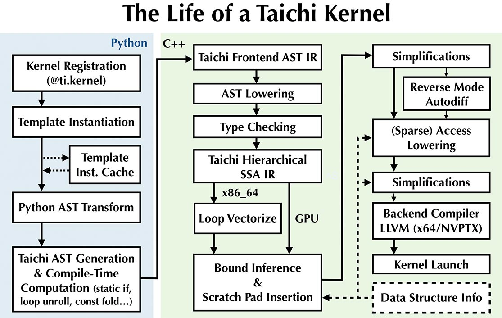

# Documentation writing guide

This section briefly introduces syntax that will help you write documentation on this website. Note that the documentation is written in an extended version of [Markdown](https://daringfireball.net/projects/markdown/syntax), so most of the time you don't need special syntax besides the basic Markdown syntax.

## 1. Code blocks

This website supports inserting code blocks with highlighted lines. For example, the following snippet:

````md
```python {1-2,4,6} title=snippet.py
@ti.kernel
def paint(t: float):
    for i, j in pixels:  # Parallelized over all pixels
        c = ti.Vector([-0.8, ti.cos(t) * 0.2])
        z = ti.Vector([i / n - 1, j / n - 0.5]) * 2
        iterations = 0
        while z.norm() < 20 and iterations < 50:
            z = complex_sqr(z) + c
            iterations += 1
        pixels[i, j] = 1 - iterations * 0.02
```
````

will result in a code block like:

```python {1-2,4,6} title=snippet.py
@ti.kernel
def paint(t: float):
    for i, j in pixels:  # Parallelized over all pixels
        c = ti.Vector([-0.8, ti.cos(t) * 0.2])
        z = ti.Vector([i / n - 1, j / n - 0.5]) * 2
        iterations = 0
        while z.norm() < 20 and iterations < 50:
            z = complex_sqr(z) + c
            iterations += 1
        pixels[i, j] = 1 - iterations * 0.02
```

## 2. Tables

```md
| Some Table Col 1 | Some Table Col 2 |
| :--------------: | :--------------: |
|       Val1       |       Val4       |
|       Val2       |       Val5       |
|       Val3       |       Val6       |
```

| Some Table Col 1 | Some Table Col 2 |
| :--------------: | :--------------: |
|       Val1       |       Val4       |
|       Val2       |       Val5       |
|       Val3       |       Val6       |

:::tip TIP
[Tables Generator](https://www.tablesgenerator.com/markdown_tables) is a great tool for generating and re-formatting Markdown tables.
:::

## 3. Cross-references

To link to another section within the same article, you would use `[Return to ## 1. Code blocks](#1-code-blocks)`: [Return to ## 1. Code blocks](#1-code-blocks).

We follow the best practices suggested by [Docusaurus](https://docusaurus.io/docs/docs-markdown-features#referencing-other-documents) to cross-reference other documents, so to link to sections in other articles, please use the following relative-path based syntax, which
is docs-versioning and IDE/GitHub friendly:

- `Return to [Contribution guidelines](./contributor_guide.md)`: Return to [Contribution guidelines](./contributor_guide.md)
- `Return to [Getting Started](../get-started/index.md#fields)`: Return to [Getting Started](../get-started/index.md#fields)

## 4. Centered text blocks

To make a text or image block centered, use:

```md
<center>

Centered Text Block!

</center>
```

<center>

Centered Text Block!

</center>

:::danger NOTE
You **HAVE TO** insert blank lines to make them work:

```md
<center>


</center>
```

:::

## 5. Text with color backgrounds

You could use the following to highlight your text:

```md
<span id="inline-blue"> Text with a blue background </span>,
<span id="inline-purple"> Text with a purple background </span>,
<span id="inline-yellow"> Text with a yellow background </span>,
<span id="inline-green"> Text with a green background </span>
```

<span id="inline-blue"> Text with a blue background </span>,
<span id="inline-purple"> Text with a purple background </span>,
<span id="inline-yellow"> Text with a yellow background </span>,
<span id="inline-green"> Text with a green background </span>

## 6. Custom containers

As you already saw in this guide several times, you could add custom containers:

```md
:::tip
This is a tip without a title!
:::
```

:::tip
This is a tip without a title!
:::

```md
:::tip TITLE
This is a tip with a title!
:::
```

:::tip TITLE
This is a tip with a title!
:::

```md
:::note
This is a note!
:::
```

:::note
This is a note!
:::

```md
:::caution WARNING
This is a warning!
:::
```

:::caution WARNING
This is a warning!
:::

```md
:::danger DANGER
This is a danger!
:::
```

:::danger DANGER
This is a danger!
:::

## 7. Code groups

You could also insert tab-based code groups:

```md
import Tabs from '@theme/Tabs';
import TabItem from '@theme/TabItem';

<Tabs
  defaultValue="apple"
  values={[
    {label: 'Apple', value: 'apple'},
    {label: 'Orange', value: 'orange'},
    {label: 'Banana', value: 'banana'},
  ]}>
  <TabItem value="apple">This is an apple 🍎.</TabItem>
  <TabItem value="orange">This is an orange 🍊.</TabItem>
  <TabItem value="banana">This is a banana 🍌.</TabItem>
</Tabs>
```

import Tabs from '@theme/Tabs';
import TabItem from '@theme/TabItem';

<Tabs
  defaultValue="apple"
  values={[
    {label: 'Apple', value: 'apple'},
    {label: 'Orange', value: 'orange'},
    {label: 'Banana', value: 'banana'},
  ]}>
  <TabItem value="apple">This is an apple 🍎.</TabItem>
  <TabItem value="orange">This is an orange 🍊.</TabItem>
  <TabItem value="banana">This is a banana 🍌.</TabItem>
</Tabs>

## 8. Footnotes

To add footnotes, use:

```md
This sentence[^1] has two footnotes[^2]. (See the footnotes at the bottom of this guide.)

[^1]: I'm a footnote!
[^2]: I'm also a footnote!
```

which results in:

---

This sentence[^1] has two footnotes[^2]. (See the footnotes at the bottom of this guide.)

[^1]: I'm a footnote!
[^2]: I'm also a footnote!

---

## 9. Images

Inserting images is as straight-forward as using the ordinary Markdown syntax:

```md

```


## 10. In-line Table of Contents (ToC)

You could use:

```md
import TOCInline from '@theme/TOCInline';

<TOCInline toc={toc} />
```

to insert an in-line ToC:

import TOCInline from '@theme/TOCInline';

<TOCInline toc={toc} />
