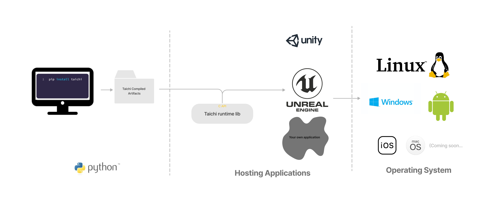
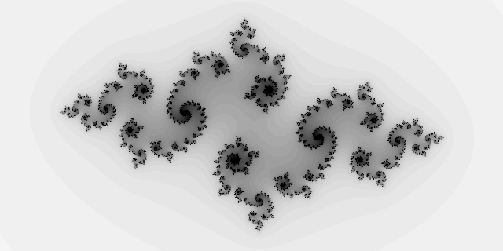

# Tutorial: Run Taichi programs in C++ applications

Taichi makes it easy to write high-performance programs with efficient parallelism, but in many applications we cannot simply deploy the Python scripts. Taichi offers a runtime library (TiRT) with a C interface as well as its C++ wrapper, so your Taichi kernels can be launched in any native application. In this tutorial, we'll walk through the steps to deploy a Taichi program in a C++ application.

## Overview



In Python, when you call a function decorated with `@ti.kernel`, Taichi immediately compiles the kernel and sends it to the device for execution. This is called just-in-time (JIT) compilation. However, in general, we don't want to compile the kernels on a mobile phone, or to expose the source code to the users. For this Taichi introduced ahead-of-time (AOT) compilation so that you can compile kernels on a development machine, and launch them on user devices via TiRT.

In summary, running a Taichi program in C++ applications involves two steps:

1. Compile Taichi kernels from Python and save the artifacts.
2. Load the AOT modules with TiRT and launch them in your applications.

Although this tutorial only demonstrates integrating Taichi in a C++ application, the C interface allows you to integrate TiRT with many other programming languages including C/C++, Swift, Rust, C# (via P/Invoke) and Java (via JNI).

## Quick-Start

In this section, we will write a Taichi kernel for generating images for [Julia fractal](https://en.wikipedia.org/wiki/Julia_set) and deploy it in a C++ application. The following shows the project layout. Next, we will walk through the steps to see what they do.

```
.
├── cmake
│   └── FindTaichi.cmake    // finds the Taichi runtime library
├── CMakeLists.txt          // builds the project
├── app.py                  // defines and compiles the Taichi kernel
├── app.cpp                 // deploys the compiled artifact to the application
└── module.tcm              // the compiled Taichi kernel artifact
```

Before we start, it is recommended to install Taichi through `taichi-nightly` Python wheels using the following command. Be aware that there's no strong version compatibility enforced yet, so it's highly recommended to use the Taichi built from exactly the same commit.

```shell
pip install -i https://pypi.taichi.graphics/simple/ taichi-nightly
```

### 1. Compile Taichi kernel in Python script

We firstly write a Python script named `app.py`, which compiles the Taichi kernel as an artifact. Save the following code to your local machine and run the program, you will obtain an archived `module.tcm` in the same directory as `app.py`.

```python
import taichi as ti

ti.init(arch=ti.vulkan)
if ti.lang.impl.current_cfg().arch != ti.vulkan:
    raise RuntimeError("Vulkan is not available.")

@ti.kernel
def paint(n: ti.u32, t: ti.f32, pixels: ti.types.ndarray(dtype=ti.f32, ndim=2)):
    for i, j in pixels:  # Parallelized over all pixels
        c = ti.Vector([-0.8, ti.cos(t) * 0.2])
        z = ti.Vector([i / n - 1, j / n - 0.5]) * 2
        iterations = 0
        while z.norm() < 20 and iterations < 50:
            z = ti.Vector([z[0]**2 - z[1]**2, z[1] * z[0] * 2]) + c
            iterations += 1
        pixels[i, j] = 1 - iterations * 0.02

mod = ti.aot.Module(ti.vulkan)
mod.add_kernel(paint)
mod.archive("module.tcm")
```

Let's dive into the code example to see what happened.

We initialize Taichi specifing the backend as `ti.vulkan` at the beginning. Considering that Taichi will fall back to CPU device if the target architecture is unavailable, we check if the current backend meets our requirement.

```python
ti.init(arch=ti.vulkan)
if ti.lang.impl.current_cfg().arch != ti.vulkan:
    raise RuntimeError("Vulkan is not available.")
```

Then, we define our Taichi kernel for computing each pixel in our program. A Taichi kernel describes two aspects of a computer program: the computation itself, and the data it operates on. Because we don't know what kind of data will be fed into the kernel before execution, we have to clearly annotate the argument types for the AOT compiler.

Taichi AOT module supports the following argument types: `ti.i32`, `ti.f32`, `ti.Ndarray`. Despite integers and floating-point numbers, we have a commonly-used data container called [`Ndarray`](https://docs.taichi-lang.org/api/taichi/lang/_ndarray/#taichi.lang._ndarray.Ndarray). It's similar to an [`ndarray`](https://numpy.org/doc/stable/reference/generated/numpy.ndarray.html) in NumPy, or a [`Tensor`](https://pytorch.org/docs/stable/tensors.html) in PyTorch. It can be multidimensional and is laid out continuously in memory. If you have experienced the multidimensional arrays in C++, You can treat it as a nested array type like `float[6][14]`.

Our Taichi kernel accepts an integer `n`, a float-pointing number `t` and a 2-dimensional Ndarray `pixels` as arguments. Each element of `pixels` is a floating-point number ranges from 0.0 to 1.0.

```python
@ti.kernel
def paint(n: ti.i32, t: ti.f32, pixels: ti.types.ndarray(dtype=ti.f32, ndim=2)):
    for i, j in pixels:  # Parallelized over all pixels
        c = ti.Vector([-0.8, ti.cos(t) * 0.2])
        z = ti.Vector([i / n - 1, j / n - 0.5]) * 2
        iterations = 0
        while z.norm() < 20 and iterations < 50:
            z = ti.Vector([z[0]**2 - z[1]**2, z[1] * z[0] * 2]) + c
            iterations += 1
        pixels[i, j] = 1 - iterations * 0.02
```

Finally, we compile the kernel into an artifact. The following piece of code initializes the AOT module and add the kernel to the module. The compiled artifact is saved as `module.tcm` in the working directory.

```python
mod = ti.aot.Module(ti.vulkan)
mod.add_kernel(paint)
mod.archive("module.tcm")
```

### 2. Work with Taichi C-API in C++ program

We are now done with Python and well prepared to build our application. The compiled artifacts saved as `module.tcm` and the Taichi Runtime Libirary (TiRT) are all we need. TiRT provides a fundamental C interface to help achieve optimal portability, however we also provide a header-only C++ wrapper to save you from writing verbose C code. For simplicity purpose, we'll stick with the C++ wrapper in this tutorial.

Firstly, we need to include the C++ wrapper header of Taichi C-API.

```c++
#include <taichi/cpp/taichi.hpp>
```

Next, create a Taichi runtime with target architecture. We will further load the compiled artifacts from `module.tcm` and load our `paint` kernel from the module.

```C++
ti::Runtime runtime(TI_ARCH_VULKAN);
ti::AotModule aot_module = runtime.load_aot_module("module.tcm");
ti::Kernel kernel_paint = aot_module.get_kernel("paint");
```

The `paint` kernel accepts three arguments, and thus we need to declare corresponding variables in C++ program. We allocate memory through TiRT's `allocate_ndarray` interface for the `pixels`, the width and the height are set to `2 * n` and `n` respectively, and the element shape is set to `1`.

```c++
int n = 320;
float t = 0.0f;
ti::NdArray<float> pixels = runtime.allocate_ndarray<float>({(uint32_t)(2 * n), (uint32_t)n}, {1}, true);
```

Then, we specify the arguments for the kernel, where the index for `kernel_paint` indicates the position in the kernel's argument list. Launch the kernel, and wait for the Taichi kernel process to finish.

```c++
kernel_paint[0] = n;
kernel_paint[1] = t;
kernel_paint[2] = pixels;
kernel_paint.launch();
runtime.wait();
```

Finally, the `pixels` Ndarray holds the kernel output. Before we read the output pixel data, we must map a device memory to a user-addressable space. The image data is saved in a plain text ppm format with a utility function `save_ppm`. For the ppm format, please refer to [Wikipedia](https://en.wikipedia.org/wiki/Netpbm#File_formats).

```c++
auto pixels_data = (const float*)pixels.map();
save_ppm(pixels_data, 2 * n, n, "result.ppm");
pixels.unmap();
```

The complete C++ source code is shown below, which is saved as `app.cpp` in the same directory as `app.py`.

```c++
#include <fstream>
#include <taichi/cpp/taichi.hpp>

void save_ppm(const float* pixels, uint32_t w, uint32_t h, const char* path) {
  std::fstream f(path, std::ios::out | std::ios::trunc);
  f << "P3\n" << w << ' ' << h << "\n255\n";
  for (int j = h - 1; j >= 0; --j) {
    for (int i = 0; i < w; ++i) {
      f << static_cast<uint32_t>(255.999 * pixels[i * h + j]) << ' '
        << static_cast<uint32_t>(255.999 * pixels[i * h + j]) << ' '
        << static_cast<uint32_t>(255.999 * pixels[i * h + j]) << '\n';
    }
  }
  f.flush();
  f.close();
}

int main(int argc, const char** argv) {
  ti::Runtime runtime(TI_ARCH_VULKAN);
  ti::AotModule aot_module = runtime.load_aot_module("module.tcm");
  ti::Kernel kernel_paint = aot_module.get_kernel("paint");

  int n = 320;
  float t = 0.0f;
  ti::NdArray<float> pixels = runtime.allocate_ndarray<float>({(uint32_t)(2 * n), (uint32_t)n}, {1}, true);

  kernel_paint[0] = n;
  kernel_paint[1] = t;
  kernel_paint[2] = pixels;
  kernel_paint.launch();
  runtime.wait();

  auto pixels_data = (const float*)pixels.map();
  save_ppm(pixels_data, 2 * n, n, "result.ppm");
  pixels.unmap();

  return 0;
}
```

### 3. Build project with CMake

CMake is utilized to build our project, and we introduce the utility CMake module [`cmake/FindTaichi.cmake`](https://github.com/taichi-dev/taichi/blob/master/c_api/cmake/FindTaichi.cmake). It firstly find Taichi installation directory according to the environment variable `TAICHI_C_API_INSTALL_DIR`, without which CMake will find the Taichi library in Python wheel. Then, it will define the `Taichi::Runtime` target which is linked to our project.

The utility module is further included in the `CMakeLists.txt` which looks like as below.

```cmake
cmake_minimum_required(VERSION 3.17)

set(TAICHI_AOT_APP_NAME TaichiAot)
project(${TAICHI_AOT_APP_NAME} LANGUAGES C CXX)
set(CMAKE_CXX_STANDARD 17)
set(CMAKE_CXX_STANDARD_REQUIRED ON)

# Declare executable target.
add_executable(${TAICHI_AOT_APP_NAME} app.cpp)
target_include_directories(${TAICHI_AOT_APP_NAME} PUBLIC ${TAICHI_C_API_INSTALL_DIR}/include)

# Find and link Taichi runtime library.
set(CMAKE_MODULE_PATH ${PROJECT_SOURCE_DIR}/cmake)
find_package(Taichi REQUIRED)
target_link_libraries(${TAICHI_AOT_APP_NAME} Taichi::Runtime)
```

Build the project with the commands:

```shell
cmake -B build
cmake --build build
```

Run the executable TaichiAOT demo:

```shell
./build/TaichiAOT
```

An image of Julia fractal shown below is saved as `result.ppm` in the project directory.



## FAQ

### Map your Taichi data types from Python to C++

| Python | C++ |
| --- | --- |
| scalar | C++ scalar type |
| ti.vector / ti.matrix | std::vector |
| ti.ndarray | ti::Ndarray |
| ti.Texture | ti::Texture |
| ti.field   | WIP         |

### Does Taichi support device import/export?

Yes! We understand that in real applications it's pretty common to hook Taichi in your existing Vulkan pipeline. As a result, you can choose to import an external device for Taichi to use, or export a device that Taichi creates to share with the external application

### Which backends & hardware are supported?

Currently `ti.vulkan`, `ti.opengl`, `ti.x86` and `ti.cuda` are supported. `ti.metal` is not yet supported.

### How can I debug a C++ application with embedded Taichi?

1. Check ti_get_last_error() whenever you call a Taichi C API.
2. Enable backward-cpp in your application to locate the source of crashes. E.g. <https://github.com/taichi-dev/taichi-aot-demo/pull/69>
3. Get values of ndarrays back on host using ndarray.read(), e.g. <https://github.com/taichi-dev/taichi-aot-demo/pull/57/files#diff-d94bf1ff63835d9cf87e700ca3c37d1e9a3c09e5994944db2adcddf132a71d0cR32>
4. Enable printing in shaders, e.g. <https://github.com/taichi-dev/taichi-aot-demo/pull/55>

### Does Taichi support generating shaders for different deployment targets?

Yes, you can specify the target device capabilities in `ti.aot.Module(arch=, caps=[])`. Future support for compiling to a different architecture from `ti.init()` is planned.

### Are Taichi compiled artifacts versioned?

There is no official versioning yet (pre-release). For now, use Taichi and C++ runtime built from the same commit for compatibility.

### Can I hook Taichi into a render pipeline?

Yes! If you already have a rendering pipeline, you can interop with Taichi via <https://docs.taichi-lang.org/docs/taichi_vulkan>.

If you don't have one already, please check out our demos at <https://github.com/taichi-dev/taichi-aot-demo>

### I just want to use raw shaders generated by Taichi. Where can I find them?

Yes, you can find the raw shaders generated by Taichi in the target folder of the aot save. However, it's important to note that launching Taichi shaders requires a special setup that relates to the implementation details in Taichi and may change without notice. If you have strict size limitations for your application and the provided runtime is too large to fit, you may consider writing a minimal Taichi runtime in C that consumes these raw shaders.

### Can I build the libtaichi_c_api.so from source?

Usually, for simplicity and stability, we recommend using the official nightly taichi wheels and the c_api shipped inside the wheel. But if you want a runtime library with special build configuration:

```
TAICHI_CMAKE_ARGS="-DTI_WITH_VULKAN:BOOL=ON -DTI_WITH_C_API:BOOL=ON" python setup.py develop

# Other commonly used CMake options
- TI_WITH_OPENGL
- TI_WITH_CPU
- TI_WITH_CUDA
```

You can find the built `libtaichi_c_api.so` and its headers in the `_skbuild/` folder.


### Taichi/C API Reference Manual

<https://docs.taichi-lang.org/docs/taichi_core#api-reference>


### When do I need to recompile my artifacts?

It is recommended to recompile the Taichi artifacts when changes are made to the following:

- Updates to the kernels and their corresponding launch logic in Python
- The need to use a newer version of either the Python Taichi or runtime library
- The target device has a different set of capabilities
- Updating some Python constants that are encoded as constants in the Taichi compiled artifacts

Please note that due to the nature of Ndarray handling in Taichi, the generated shaders can be used for Ndarrays with different shapes as long as their ranks match. This is a convenient feature if you need to use a single set of shaders for various scenarios, such as different screen sizes on Android phones.

### How can I set values for ndarrays in C++?

In the C++ wrapper we provide these convenient read/write() methods on NdArray class. <https://github.com/taichi-dev/taichi/blob/master/c_api/include/taichi/cpp/taichi.hpp#L192-L215>

In C API you can allocate your memory as host accessible and then use map/unmap. <https://docs.taichi-lang.org/docs/taichi_core>
