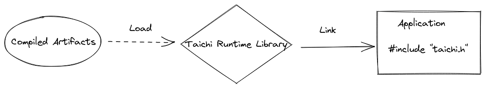

# Tutorial: Run Taichi programs in C++ applications

Taichi makes it easy to write high-performance programs with efficient parallelism, but in many applications we cannot simply deploy the Python scripts. Taichi offers a runtime library (TiRT) with a C interface so that your Taichi kernels can be launched in any native application. In this tutorial, we'll walk through the steps to deploy a Taichi program in a C++ application.

## Overview


In Python, when you call a function decorated with `@ti.kernel`, Taichi immediately compiles the kernel and sends it to the device for execution. This is called just-in-time (JIT) compilation. But generally speaking, we don't want to compile the kernels on a mobile phone, or to expose the source code to the users. For this Taichi introduced ahead-of-time (AOT) compilation so that you can compile kernels on a development machine, and launch them on user devices via TiRT.

1. Compile Taichi kernels from Python and save the artifacts.
2. Load AOT modules with TiRT and launch them in your applications.

Although this tutorial only demonstrates integrating Taichi in a C++ application, the C interface allows you to integrate TiRT with many other programming languages including C/C++, Swift, Rust, C# (via P/Invoke) and Java (via JNI).

### 1. Write kernels for AOT compilation

A Taichi kernel describes two aspects of a computer program: The computation itself, and the data it operates on. Because we don't know what kind of data will be fed into the kernel before execution, we have to clearly annotate the argument types for the AOT compiler.

Taichi supports the following argument types:

- `ti.i32`
- `ti.f32`
- `ti.Ndarray`

Despite integers and floating-point numbers, we have a commonly-used data container called [`Ndarray`](https://docs.taichi-lang.org/api/taichi/lang/_ndarray/#taichi.lang._ndarray.Ndarray). It's similar to an [`ndarray`](https://numpy.org/doc/stable/reference/generated/numpy.ndarray.html) in NumPy, or a [`Tensor`](https://pytorch.org/docs/stable/tensors.html) in PyTorch. It can be multidimensional and is laid out continuously in memory. If you have experienced the multidimensional arrays in C++, You can treat it as a nested array type like `float[6][14]`.

As an example of its usage, the following init kernel has an Ndarray argument named x. The dtype attribute is set to ti.f32 to specify that the Ndarray stores floating-point data, and the ndim attribute is set to 1, indicating that the Ndarray has only one dimension. Upon execution, every element within the x Ndarray will be set to zero.

```python
@ti.kernel
def init(x: ti.types.ndarray(dtype=ti.f32, ndim=1)):
    for i in x:
        x[i] = 0
```

After initialization, in kernel `add_base`, we want to add a floating-point number `base` to those in `x` in each frame.

```python
@ti.kernel
def add_base(x: ti.types.ndarray(ndim=1), base: ti.f32):
    for i in range(x.shape[0]):
        x[i] += base
```

You can also create an ndarray and launch the kernels in the same script to ensure they do everything you expect.

```python
x = ti.ndarray(ti.f32, shape=(8192))
init(x)

N_ITER = 50
for _ in range(N_ITER):
    add_base(x, 0.1)
```

### 2. Compile and save the artifacts

Now let's compile the kernels into an AOT module.
The compiled version of a Taichi kernel, such as the `add_base` example, includes all compiled components that were generated when compiling the `ti.kernel` . In this case, the argument base has a declared data type of `ti.f32`. This type information is used during the compilation process and is embedded within the compiled artifact. At runtime, the `add_base` kernel can be executed with any floating-point number as the argument for base.

```python
mod = ti.aot.Module(ti.vulkan)
mod.add_kernel(init, template_args={'x': x})
mod.add_kernel(add_base, template_args={'x': x})
mod.save(target_dir)
```

`ti.types.ndarray` is a bit more complicated since it requires both `dtype` and `ndim` as its type information. To compile Taichi kernels with `ti.types.ndarray` arguments, you'll have to supply that information either directly in the type annotation, or provide an example input via `template_args`.

Now that we're done with Kernel compilation, let's take a look at the generated artifacts and its layout:

```text
// FUTURE WORK: This is just a zip. Replace tcb with readable JSON
// Structure of compiled artifacts
.
├── demo
│   ├── add_base_c78_0_k0001_vk_0_t00.spv
│   ├── init_c76_0_k0000_vk_0_t00.spv
│   └── metadata.json
└── demo.py
```

### 3. Get Taichi Runtime Library (TiRT)




With the completion of your Python work, you are now ready to develop your application! The compiled artifacts and TiRT that you have saved are all you require.

Currently, TiRT is included with the `taichi-nightly` Python package. Please note that there is not yet a strict version compatibility enforced, so it is strongly advised to use a Python Taichi and TiRT that were built from the same exact commit for compatibility purposes.

TODO: We'll figure out a proper way to release it once the versioning issue is improved.

```bash
# Install python taichi:
pip install -i https://pypi.taichi.graphics/simple/ taichi-nightly
# Get the runtime library:
pip download --no-deps -i https://pypi.taichi.graphics/simple/ taichi-nightly
# For example
unzip taichi_nightly-1.3.0.post20221102-cp38-cp38-manylinux_2_27_x86_64.whl
export TAICHI_C_API_INSTALL_DIR=$PWD/taichi_nightly-1.3.0.post20221102.data/data/c_api/
```

Currently, only TiRT for Linux systems is included in the nightly distributions. If you need one for Android / Windows, please see the FAQ below to build it from source.

Integrate `TiRT` to your CMakeLists.txt:

```cmake
# Find built taichi C-API library in `TAICHI_C_API_INSTALL_DIR`.
find_library(taichi_c_api taichi_c_api HINTS ${TAICHI_C_API_INSTALL_DIR}/lib NO_CMAKE_FIND_ROOT_PATH)
if (NOT EXISTS ${taichi_c_api})
    message(FATAL_ERROR "Couldn't find C-API library in ${TAICHI_C_API_INSTALL_DIR}")
endif()

# Make sure your target is properly linked!
set(TAICHI_TUTORIAL_DEMO_NAME "0_tutorial_kernel")
message("-- Building ${TAICHI_TUTORIAL_DEMO_NAME}")
add_executable(${TAICHI_TUTORIAL_DEMO_NAME} ${CMAKE_CURRENT_SOURCE_DIR}/app.cpp)
target_include_directories(${TAICHI_TUTORIAL_DEMO_NAME} PUBLIC ${TAICHI_C_API_INSTALL_DIR}/include)
target_link_libraries(${TAICHI_TUTORIAL_DEMO_NAME} ${taichi_c_api})
```

### 4. Run taichi kernels in your application

TiRT provides a fundamental C interface to help achieve optimal portability, however we also kindly provide a header-only C++ wrapper to save you from writing verbose C code. For simplicity purpose, we'll stick with the C++ wrapper in this tutorial.

Calling Taichi in C++ as easy as what you'd imagine:

- Create a Taichi runtime with target arch
- Load the compiled artifacts from disk through TiRT's `load_aot_module` interface.
- Load kernels from the module to `k_init_` and `k_add_base_`
- Prepare the inputs: ndarray `x_` and float `base`
- Launch the kernels!

A complete C++ application with embedded Taichi is shown below:

```cpp
#include <taichi/cpp/taichi.hpp>

struct App0_tutorial {
  static const uint32_t NPARTICLE = 8192 * 2;
  static const uint32_t N_ITER = 50;

  ti::Runtime runtime_;
  ti::AotModule module_;
  ti::Kernel k_init_;
  ti::Kernel k_add_base_;
  ti::NdArray<float> x_;

  App0_tutorial() {
    runtime_ = ti::Runtime(TI_ARCH_VULKAN);
    module_ = runtime_.load_aot_module("0_tutorial_kernel/assets/tutorial");
    k_init_ = module_.get_kernel("init");
    k_add_base_ = module_.get_kernel("add_base");
    x_ = runtime_.allocate_ndarray<float>({NPARTICLE}, {}, true);
    std::cout << "Initialized!" << std::endl;
  }

  bool run() {
    float base = 0.2;

    k_init_.push_arg(x_);
    k_init_.launch();
    k_add_base_.push_arg(x_);
    k_add_base_.push_arg(base);
    for (int i = 0; i < N_ITER; i++) {
      k_add_base_.launch();
    }
    runtime_.wait();
    return true;
  }
};

int main(int argc, const char** argv) {
  App0_tutorial app;
  app.run();
  return 0;
}
```

## FAQ

### Map your Taichi data types from Python to C++

| Python | C++ |
| --- | --- |
| scalar | C++ scalar type |
| ti.vector / ti.matrix | std::vector |
| ti.ndarray | ti::Ndarray |
| ti.Texture | ti::Texture |
| ti.field   | WIP         |

### Does Taichi support device import/export?

Yes! We understand that in real applications it's pretty common to hook Taichi in your existing Vulkan pipeline. As a result, you can choose to import an external device for Taichi to use, or export a device that Taichi creates to share with the external application

### Which backends & hardware are supported?

Currently `ti.vulkan`, `ti.opengl`, `ti.x86` and `ti.cuda` are supported. `ti.metal` is not yet supported.

### How can I debug a C++ application with embedded Taichi?

1. Check ti_get_last_error() whenever you call a Taichi C API.
2. Enable backward-cpp in your application to locate the source of crashes. E.g. <https://github.com/taichi-dev/taichi-aot-demo/pull/69>
3. Get values of ndarrays back on host using ndarray.read(), e.g. <https://github.com/taichi-dev/taichi-aot-demo/pull/57/files#diff-d94bf1ff63835d9cf87e700ca3c37d1e9a3c09e5994944db2adcddf132a71d0cR32>
4. Enable printing in shaders, e.g. <https://github.com/taichi-dev/taichi-aot-demo/pull/55>

### Does Taichi support generating shaders for different deployment targets?

Yes, you can specify the target device capabilities in `ti.aot.Module(arch=, caps=[])`. Future support for compiling to a different architecture from `ti.init()` is planned.

### Are Taichi compiled artifacts versioned?

There is no official versioning yet (pre-release). For now, use Taichi and C++ runtime built from the same commit for compatibility.

### Can I hook Taichi into a render pipeline?

Yes! If you already have a rendering pipeline, you can interop with Taichi via <https://docs.taichi-lang.org/docs/taichi_vulkan>.

If you don't have one already, please check out our demos at <https://github.com/taichi-dev/taichi-aot-demo>

### I just want to use raw shaders generated by Taichi. Where can I find them?

Yes, you can find the raw shaders generated by Taichi in the target folder of the aot save. However, it's important to note that launching Taichi shaders requires a special setup that relates to the implementation details in Taichi and may change without notice. If you have strict size limitations for your application and the provided runtime is too large to fit, you may consider writing a minimal Taichi runtime in C that consumes these raw shaders.

### Can I build the libtaichi_c_api.so from source?

Usually, for simplicity and stability, we recommend using the official nightly taichi wheels and the c_api shipped inside the wheel. But if you want a runtime library with special build configuration:

```
TAICHI_CMAKE_ARGS="-DTI_WITH_VULKAN:BOOL=ON -DTI_WITH_C_API:BOOL=ON" python setup.py develop

# Other commonly used CMake options
- TI_WITH_OPENGL
- TI_WITH_CPU
- TI_WITH_CUDA
```

You can find the built `libtaichi_c_api.so` and its headers in the `_skbuild/` folder.


### Taichi/C API Reference Manual

<https://docs.taichi-lang.org/docs/taichi_core#api-reference>


### When do I need to recompile my artifacts?

It is recommended to recompile the Taichi artifacts when changes are made to the following:

- Updates to the kernels and their corresponding launch logic in Python
- The need to use a newer version of either the Python Taichi or runtime library
- The target device has a different set of capabilities
- Updating some Python constants that are encoded as constants in the Taichi compiled artifacts

Please note that due to the nature of Ndarray handling in Taichi, the generated shaders can be used for Ndarrays with different shapes as long as their ranks match. This is a convenient feature if you need to use a single set of shaders for various scenarios, such as different screen sizes on Android phones.

### How can I set values for ndarrays in C++?

In the C++ wrapper we provide these convenient read/write() methods on NdArray class. <https://github.com/taichi-dev/taichi/blob/master/c_api/include/taichi/cpp/taichi.hpp#L192-L215>

In C API you can allocate your memory as host accessible and then use map/unmap. <https://docs.taichi-lang.org/docs/taichi_core>
