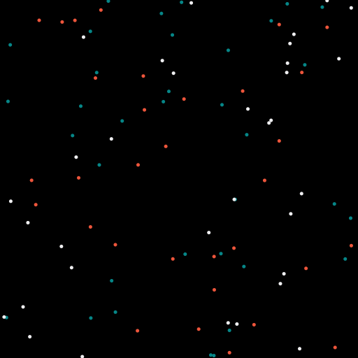
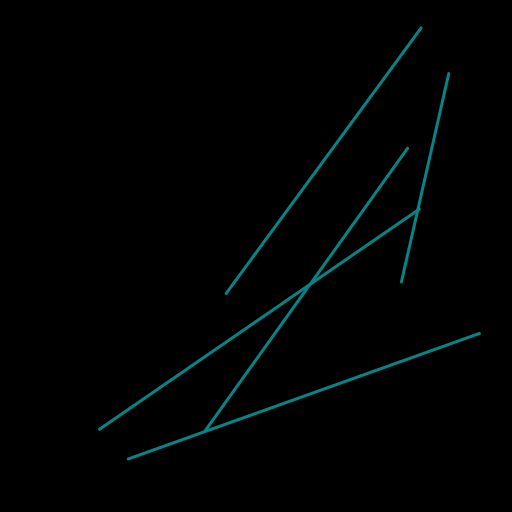

# GUI system

Taichi has a built-in cpu-based GUI system to help users visualize results.

## Create a window

The following code show how to create a window of resolution `640x360`:

```python
gui = ti.GUI('Window Title', (640, 360))
```

:::note

If you are running Taichi on a machine without a GUI environment, consider setting `show_gui` to `False`:

```python
gui = ti.GUI('Window Title', (640, 360), show_gui=False)

while gui.running:
    ...
    gui.show(f'{gui.frame:06d}.png')  # save a series of screenshot
```

:::

## Display a window

The following code snippet saves frames of the window to `.png`s:

```python
    for frame in range(10000):
        render(img)
        gui.set_image(img)
        gui.show(f'{frame:06d}.png')
```

## Paint on a window
Taichi's GUI supports painting simple geometric objects, such as lines, triangles, rectangles, circles, and text.

:::note

The position parameter of every drawing API expects input of 2-element tuples,
whose values are the relative position of the object range from 0.0 to 1.0.
(0.0, 0.0) stands for the lower left corner of the window, and (1.0, 1.0) stands for the upper right corner.

Acceptable input for positions are taichi fields or numpy arrays. Primitive arrays in python are NOT acceptable.

For simplicity, we use numpy arrays in the examples below.

:::

:::tip

Here we only list the most commonly-used APIs. For a full list of APIs and the detailed API descriptions, please
see the [API docs](https://api-docs.taichi.graphics/autoapi/taichi/ui/gui/index.html#module-taichi.ui.gui).

:::

```python
gui.circles(pos, radius=3, palette=[0x068587, 0xED553B, 0xEEEEF0], palette_indices=material)
```
draws circles with radius of 1.5 and three different colors differed by `material`, an integer array with the same size as
`pos`. Each integer in `material` indicates which color the associated circle use (i.e. array [0, 1, 2] indicates these three
circles are colored separately by the first, second, and third color in `palette`.



```python
gui.lines(begin=X, end=Y, radius=2, color=0x068587)
```
draws line segments from X positions to Y positions with width of 2 and color in light blue.



```python
gui.triangles(a=X, b=Y, c=Z, color=0xED553B)
```
draws triangles with color in red and three points positioned at X, Y, and Z.


## RGB & Hex conversion.

A handy tool for converting colors from RGB to hex and vice versa.

```python
rgb = (0.4, 0.8, 1.0)
hex = ti.rgb_to_hex(rgb)  # 0x66ccff

rgb = ti.hex_to_rgb(0x007fff) # (0.0, 0.5, 1.0)

rgb = np.array([[0.4, 0.8, 1.0], [0.0, 0.5, 1.0]])
hex = ti.rgb_to_hex(rgb)  # np.array([0x66ccff, 0x007fff])
```

The return values can be used in GUI drawing APIs.


## Event processing

Every event have a key and type.

_Event type_ is the type of event, for now, there are just three type of event:

    ti.GUI.RELEASE  # key up or mouse button up
    ti.GUI.PRESS    # key down or mouse button down
    ti.GUI.MOTION   # mouse motion or mouse wheel

_Event key_ is the key that you pressed on keyboard or mouse, can be one of:

    # for ti.GUI.PRESS and ti.GUI.RELEASE event:
    ti.GUI.ESCAPE  # Esc
    ti.GUI.SHIFT   # Shift
    ti.GUI.LEFT    # Left Arrow
    'a'            # we use lowercase for alphabet
    'b'
    ...
    ti.GUI.LMB     # Left Mouse Button
    ti.GUI.RMB     # Right Mouse Button

    # for ti.GUI.MOTION event:
    ti.GUI.MOVE    # Mouse Moved
    ti.GUI.WHEEL   # Mouse Wheel Scrolling

A _event filter_ is a list combined of _key_, _type_ and _(type, key)_ tuple, e.g.:

```python
# if ESC pressed or released:
gui.get_event(ti.GUI.ESCAPE)

# if any key is pressed:
gui.get_event(ti.GUI.PRESS)

# if ESC pressed or SPACE released:
gui.get_event((ti.GUI.PRESS, ti.GUI.ESCAPE), (ti.GUI.RELEASE, ti.GUI.SPACE))
```

`gui.running` checks the state of the window. `ti.GUI.EXIT` occurs when
you click on the close (X) button of a window. `gui.running` will obtain
`False` when the GUI is being closed.

For example, loop until the close button is clicked:

    while gui.running:
        render()
        gui.set_image(pixels)
        gui.show()

You can also close the window by manually setting `gui.running` to`False`:

    while gui.running:
        if gui.get_event(ti.GUI.ESCAPE):
            gui.running = False

        render()
        gui.set_image(pixels)
        gui.show()

`gui.get_event(a, ...)` tries to pop an event from the queue, and stores it into `gui.event`.

For example:

    if gui.get_event():
        print('Got event, key =', gui.event.key)

For example, loop until ESC is pressed:

    gui = ti.GUI('Title', (640, 480))
    while not gui.get_event(ti.GUI.ESCAPE):
        gui.set_image(img)
        gui.show()

`gui.is_pressed(key, ...)` detects the keys you pressed. You must use it
together with `gui.get_event`. Otherwise, it is not updated. For example:

    while True:
        gui.get_event()  # must be called before is_pressed
        if gui.is_pressed('a', ti.GUI.LEFT):
            print('Go left!')
        elif gui.is_pressed('d', ti.GUI.RIGHT):
            print('Go right!')

:::caution

`gui.is_pressed()` must be used together with `gui.get_event()`, or it won't be updated!

:::

For example:

```python
while True:
    gui.get_event() # must be called before is_pressed
    if gui.is_pressed('a', ti.GUI.LEFT):
        print('Go left!')
    elif gui.is_pressed('d', ti.GUI.RIGHT):
        print('Go right!')
```

`gui.get_cursor_pos()` retrieves the current cursor position on the window. For example:

    mouse_x, mouse_y = gui.get_cursor_pos()


## GUI Widgets

Sometimes it's more intuitive to use widgets like slider or button to control the program variables instead of using chaotic keyboard bindings. Taichi GUI provides a set of widgets for that reason:

```python
import taichi as ti

gui = ti.GUI('GUI widgets')

radius = gui.slider('Radius', 1, 50, step=1)
xcoor = gui.label('X-coordinate')
okay = gui.button('OK')

xcoor.value = 0.5
radius.value = 10

while gui.running:
    for e in gui.get_events(gui.PRESS):
        if e.key == gui.ESCAPE:
            gui.running = False
        elif e.key == 'a':
            xcoor.value -= 0.05
        elif e.key == 'd':
            xcoor.value += 0.05
        elif e.key == 's':
            radius.value -= 1
        elif e.key == 'w':
            radius.value += 1
        elif e.key == okay:
            print('OK clicked')

    gui.circle((xcoor.value, 0.5), radius=radius.value)
    gui.show()
```


## Image I/O

`ti.imwrite(img, filename)` exports an `np.ndarray` or a Taichi field
(`ti.Matrix.field`,  `ti.Vector.field`, or `ti.field`) to a file with a specified `filename`.

Same as `ti.GUI.show(filename)`, the format of the exported image is determined by **the suffix of** `filename` as well. Now `ti.imwrite` supports exporting images to `png`, `img` and `jpg` and we recommend using `png`.

Please make sure that the input image has **a valid shape**. If you want to export a grayscale image, the input shape of field should be `(height, weight)` or `(height, weight, 1)`. For example:

```python
import taichi as ti

ti.init()

shape = (512, 512)
type = ti.u8
pixels = ti.field(dtype=type, shape=shape)

@ti.kernel
def draw():
    for i, j in pixels:
        pixels[i, j] = ti.random() * 255    # integers between [0, 255] for ti.u8

draw()

ti.imwrite(pixels, f"export_u8.png")
```

Besides, for RGB or RGBA images, `ti.imwrite` needs to receive a field which has shape `(height, width, 3)` and `(height, width, 4)` individually.

Generally the value of the pixels on each channel of a `png` image is an integer in \[0, 255\]. For this reason, `ti.imwrite` will **cast fields** which has different data types all **into integers between \[0, 255\]**. As a result, `ti.imwrite` has the following requirements for different data types of input fields:

- For float-type (`ti.f16`, `ti.f32`, etc.) input fields, **the value of each pixel should be float between \[0.0, 1.0\]**. Otherwise `ti.imwrite` will first clip them into \[0.0, 1.0\]. Then they are multiplied by 256 and cast to integers ranging from \[0, 255\].
- For int-type (`ti.u8`, `ti.u16`, etc.) input fields, **the value of each pixel can be any valid integer in its own bounds**. These integers in this field will be scaled to \[0, 255\] by being divided over the upper bound of its basic type accordingly.

Here is another example:

```python
import taichi as ti

ti.init()

shape = (512, 512)
channels = 3
type = ti.f32
pixels = ti.Matrix.field(channels, dtype=type, shape=shape)

@ti.kernel
def draw():
    for i, j in pixels:
        for k in ti.static(range(channels)):
            pixels[i, j][k] = ti.random()   # floats between [0, 1] for ti.f32

draw()

ti.imwrite(pixels, f"export_f32.png")
```

## Zero-copying frame buffer
When the GUI resolution (window size) is large, it sometimes becomes difficult to achieve 60 FPS even without any kernel
invocations between two frames.

This is mainly due to the copy overhead, where Taichi GUI needs to copy the image buffer from one place to another.
This process is necessary for the 2D drawing functions, such as `gui.circles`, to work. The larger the image shape is,
the larger the overhead.

Fortunately, sometimes your program only needs `gui.set_image` alone. In such cases, you can enable the `fast_gui` option
for better performance. This mode allows Taichi GUI to directly write the image data to the frame buffer without additional
copying, resulting in a much better FPS.

```python
gui = ti.GUI(res, title, fast_gui=True)
```

:::note

Because of the zero-copying mechanism, the image passed into `gui.set_image` must already be in the display-compatible
format. That is, this field must either be a `ti.Vector(3)` (RGB) or a `ti.Vector(4)` (RGBA). In addition, each channel
must be of type `ti.f32`, `ti.f64` or `ti.u8`.

:::

:::note

If possible, consider enabling this option, especially when `fullscreen=True`.

:::

:::caution

Despite the performance boost, it has many limitations as trade off:

`gui.set_image` is the only available paint API in this mode.

`gui.set_image` will only take Taichi 3D or 4D vector fields (RGB or RGBA) as input.

:::
