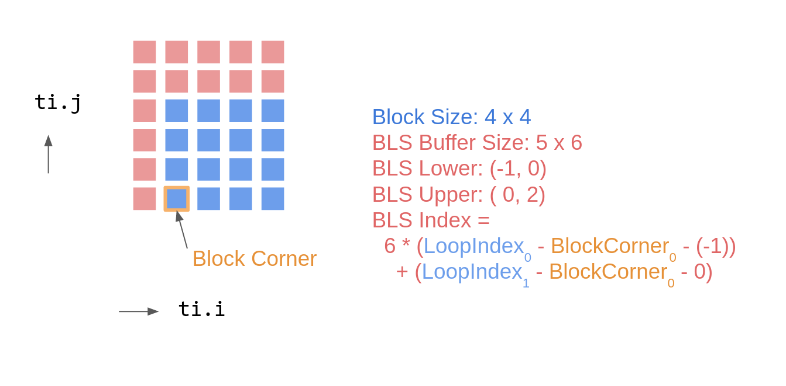

# Performance Tuning

## For-loop decorators

In Taichi kernels, for-loop in the outermost scope is automatically
parallelized. Our compiler automatically tunes the parameters to best explore
the target architecture. Nevertheless, for Ninjas who strive for the last few %
of performance, we also provide some APIs to allow developers fine-tune their
applications. For example, specifying a suitable `block_dim` could yield an almost
3x performance boost in
[examples/mpm3d.py](https://github.com/taichi-dev/taichi/blob/master/python/taichi/examples/mpm3d.py).

You can use `ti.loop_config` to set the loop directives for the next for loop. Available directives are:

- **parallelize**: Sets the number of threads to use on CPU
- **block_dim**: Sets the number of threads in a block on GPU
- **serialize**: If you set **serialize** to `True`, the for loop will run serially, and you can write break statements inside it
(Only applies on range/ndrange fors). Equals to setting **parallelize** to 1.

```python {4}
@ti.kernel
def break_in_serial_for() -> ti.i32:
    a = 0
    ti.loop_config(serialize=True)
    for i in range(100):  # This loop runs serially
        a += i
        if i == 10:
            break
    return a

break_in_serial_for()  # returns 55
```

```python {5}
n = 128
val = ti.field(ti.i32, shape=n)
@ti.kernel
def fill():
    ti.loop_config(parallelize=8, block_dim=16)
    # If the kernel is run on the CPU backend, 8 threads will be used to run it
    # If the kernel is run on the CUDA backend, each block will have 16 threads.
    for i in range(n):
        val[i] = i
```

### Background: Thread hierarchy of GPUs

To better understand how the mentioned for-loop is parallelized, we briefly
introduce the **thread hierarchy** on modern GPU architectures.

From a fine-grained to a coarse-grained level, the computation units can be
defined as: **iteration** &lt; **thread** &lt; **block** &lt; **grid**.

- **iteration**: An iteration is the **body of a for-loop**. Each
  iteration corresponding to a specific `i` value in for-loop.
- **thread**: Iterations are grouped into threads. A thread is the
  minimal unit that is parallelized. All iterations within a thread
  are executed in **serial**. We usually use 1 iteration per thread
  for maximizing parallel performance.
- **block**: Threads are grouped into blocks. All threads within a
  block are executed in **parallel**. Threads within the same block
  can share their **block local storage**.
- **grid**: Blocks are grouped into grids. Grid is the minimal unit
  that being **launched** from host. All blocks within a grid are
  executed in **parallel**. In Taichi, each **parallelized for-loop**
  is a grid.

For more details, please see [the CUDA C programming
guide](https://docs.nvidia.com/cuda/cuda-c-programming-guide/index.html#thread-hierarchy).
Note that we employ the CUDA terminology here, other backends such as OpenGL and Metal follow a similar thread hierarchy.

### Example: Tuning the block-level parallelism of a for-loop

Programmers may **prepend** some decorator(s) to tweak the property of a
for-loop, e.g.:

```python
@ti.kernel
def func():
    for i in range(8192):  # no decorator, use default settings
        ...

    ti.block_dim(128)      # change the property of next for-loop:
    for i in range(8192):  # will be parallelized with block_dim=128
        ...

    for i in range(8192):  # no decorator, use default settings
        ...
```

## Data layouts

You might have been familiar with [Fields](../basic/field.md) in Taichi. Since
Taichi decouples data structure from computation, developers have the
flexibility to play with different data layouts. Like in other programming
languages, selecting an efficient layout can drastically improve performance.
For more information on advanced data layouts in Taichi, please
see the [Fields (advanced)](../basic/layout.md) section.

## Local Storage Optimizations

Taichi comes with a few optimizations that leverage the *fast memory* (e.g. CUDA
shared memory, L1 cache) for performance optimization. The idea is straightforward:
Wherever possible, Taichi substitutes the access to the global memory (slow) with
that to the local one (fast), and writes the data in the local memory (e.g., CUDA
shared memory) back to the global memory in the end. Such transformations preserve
the semantics of the original program (will be explained later).

### Thread Local Storage (TLS)

TLS is mostly designed to optimize parallel reduction. When Taichi identifies
a global reduction pattern in a `@ti.kernel`, it automatically applies the TLS
optimizations during code generation, similar to those found in common GPU
reduction implementations.

We will walk through an example using CUDA's terminology.

```python
x = ti.field(ti.f32, shape=1000000)
s = ti.field(ti.f32, shape=())

@ti.kernel
def sum():
  for i in x:
    s[None] += x[i]

sum()
```

Internally, Taichi's parallel loop is implemented using
[Grid-Stride Loops](https://developer.nvidia.com/blog/cuda-pro-tip-write-flexible-kernels-grid-stride-loops/).
What this means is that each physical CUDA thread could handle more than one item in `x`.
That is, the number of threads launched for `sum` can be fewer than the shape of `x`.

One optimization enabled by this strategy is to substitute the global memory access
with a *thread-local* one. Concretely, instead of directly and atomically adding
`x[i]` into the destination `s[None]`, which resides in the global memory, Taichi
preallocates a thread-local buffer upon entering the thread, accumulates
(*non-atomically*) the value of `x` into this buffer, then adds the result of the
buffer back to `s[None]` atomically before exiting the thread. Assuming each thread
handles `N` items in `x`, the number of atomic adds is reduced to one-N-th its
original size.

Additionally, the last atomic add to the global memory `s[None]` is optimized using
CUDA's warp-level intrinsics, further reducing the number of required atomic adds.

Currently, Taichi supports TLS optimization for these reduction operators: `add`,
`sub`, `min` and `max` on **0D** scalar/vector/matrix `ti.field`s. It is not yet
supported on `ti.ndarray`s. [Here](https://github.com/taichi-dev/taichi/pull/2956)
is a benchmark comparison when running a global max reduction on a 1-D Taichi field
of 8M floats on an Nvidia GeForce RTX 3090 card:

* TLS disabled: 5.2 x 1e3 us
* TLS enabled: 5.7 x 1e1 us

TLS has led to an approximately 100x speedup. We also show that TLS reduction sum
achieves comparable performance with CUDA implementations, see
[benchmark](https://github.com/taichi-dev/taichi_benchmark/tree/main/reduce_sum) for
details.

### Block Local Storage (BLS)

Context: For a sparse field whose last layer is a `dense` SNode (i.e., its layer
hierarchy matches `ti.root.(sparse SNode)+.dense`), Taichi will assign one CUDA
thread block to each `dense` container (or `dense` block). BLS optimization works
specifically for such kinds of fields.

BLS aims to accelerate the stencil computation patterns by leveraging the CUDA
shared memory. This optimization starts with the users annotating the set of fields
they would like to cache via `ti.block_local`. Taichi then attempts to figure out
the accessing range w.r.t the `dense` block of these annotated fields at
*compile time*. If succeeded, Taichi generates code that first fetches all the
accessed data in range into a *block local* buffer (CUDA's shared memory), then
substitutes all the accesses to the corresponding slots into this buffer.

Here is an example illustrating the usage of BLS. `a` is a sparse field with a
block size of `4x4`.

```python {8-9}
a = ti.field(ti.f32)
b = ti.field(ti.f32)
# `a` has a block size of 4x4
ti.root.pointer(ti.ij, 32).dense(ti.ij, 4).place(a)

@ti.kernel
def foo():
  # Taichi will cache `a` into the CUDA shared memory
  ti.block_local(a)
  for i, j in a:
    print(a[i - 1, j], a[i, j + 2])
```

Each loop iteration accesses items with an offset `[-1, 0]` and `[0, 2]` to its
coordinates, respectively. Therefore, for an entire block spanning from `[M, N]`
(inclusive) to `[M + 4, N + 4]` (exclusive), the accessed range w.r.t this block
is `[M - 1, M + 4) x [N, N + 6)` (derived from `[M + (-1), M + 4) x [N, N + 4 + 2)`).
The mapping between the global coordinates `i, j` and the local indices into the
buffer is shown below:



From a user's perspective, you do not need to worry about these underlying details.
Taichi does all the inference and the global/block-local mapping automatically.
That is, Taichi will preallocate a CUDA shared memory buffer of size `5x6`,
pre-load `a`'s data into this buffer, and replace all the accesses to `a` (in the
global memory) with the buffer in the loop body. While this simple example does
not modify `a`, if a block-cached field does get written, Taichi would also generate
code that writes the buffer back to the global memory.

:::note
BLS does not come for free. Remember that BLS is designed for the stencil
computation, where there are a large amount of overlapped accesses to the global
memory. If this is not the case, the pre-loading/post-storing could actually
hurt the performance.

On top of that, recent generations of Nvidia's GPU cards have been closing the gap
on the read-only access between the global memory and the shared memory. Currently,
we found BLS to be more effective for caching the destinations of the atomic operations.

As a rule of thumb, run benchmarks to decide whether to enable BLS or not.
:::

## Offline Cache

A Taichi kernel is implicitly compiled the first time it is called. The compilation results are kept in an *online* in-memory cache to reduce the overhead in the subsequent function calls. As long as the kernel function is unchanged, it can be directly loaded and launched. The cache, however, is no longer available when the program terminates. Then, if you run the program again, Taichi has to re-compile all kernel functions and reconstruct the *online* in-memory cache. And the first launch of a Taichi function is always slow due to the compilation overhead.

We address this problem by introducing the *offline* cache feature, which dumps and saves the compilation cache on disk for future runs. The first launch overhead can be drastically reduced in repeated runs. Taichi now constructs and maintains an offline cache by default, as well as providing several options in `ti.init()` for configuring the offline cache behavior.
* `offline_cache: bool`: Enables or disables offline cache. Default: `True`.
* `offline_cache_file_path: str`: Directory holding the offline cached files. Default: `'C:\taichi_cache\ticache\'` on Windows and `'~/.cache/taichi/ticache/'` on unix-like systems. Directories are automatically populated.
* `offline_cache_max_size_of_files: int32`: Maximum size of the cached files in Bytes. Default: 100MB. A cleaning process is triggered when the size of the cached files exceeds this limit.
* `offline_cache_cleaning_policy: str`: Policy about how to replace outdated files in the cache. Options: `'never'`, `'version'`, `'lru'` and `'fifo'`. Default: `'lru'`.
  * `'never'`: Never cleans and keeps all the cached files regardless of the `offline_cache_max_size_of_files` configuration;
  * `'version'`: Discards only the old-version cached files with respect to the kernel function;
  * `'lru'`: Discards the cached files least used recently;
  * `'fifo'`: Discards the cached files added in the earliest.

To verify the effect, run some examples twice and observe the launch overhead:


For now, the offline cache feature works *only* on the CPU and CUDA backends.

:::note
If your code behaves abnormally, disable offline cache by setting the environment variable `TI_OFFLINE_CACHE=0` or `offline_cache=False` in the `ti.init()` method call and file an issue with us on [Taichi's GitHub repo](https://github.com/taichi-dev/taichi/issues/new/choose).
:::
