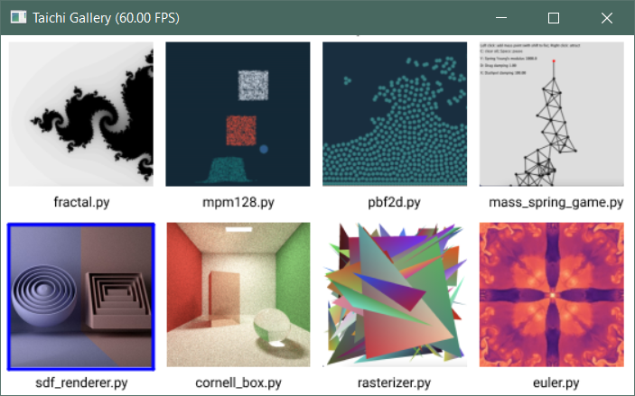

## Compatibility changes

### License change

Taichi's license is changed from MIT to Apache-2.0 after a public vote in [#4607](https://github.com/taichi-dev/taichi/issues/4607).

### Python 3.10 support

This release supports Python 3.10 on all supported operating systems (Windows, macOS, and Linux).

### Manylinux2014-compatible wheels

Before v1.0.0, Taichi works only on Linux distributions that support glibc 2.27+ (such as Ubuntu 18.04+). As of v1.0.0, in addition to the normal Taichi wheels, Taichi provides the manylinux2014-compatible wheels to work on most modern Linux distributions, including CentOS 7.

- The normal wheels support all backends; the incoming manylinux2014-compatible wheels support the CPU and CUDA backends only. Choose the wheels that work best for you.

- If you encounter any issue when installing the wheels, try upgrading your pip to the latest version first.

### Deprecations

- This release deprecates `ti.ext_arr()` and uses `ti.types.ndarray()` instead. `ti.types.ndarray()` supports both Taichi Ndarrays and external arrays, such as NumPy arrays.

- Taichi plans to drop support for Python 3.6 in the next minor release (v1.1.0). If you have any questions or concerns, please let us know at [#4772](https://github.com/taichi-dev/taichi/discussions/4772).

## New features

### Non-Python deployment solution

By working together with OPPO US Research Center, Taichi delivers Taichi AOT, a solution for deploying kernels in non-Python environments, such as in mobile devices.

Compiled Taichi kernels can be saved from a Python process, then loaded and run by the [provided C++ runtime library](./assets/libtaichi_export_core.so). With a set of APIs, your Python/Taichi code can be easily deployed in any C++ environment. We demonstrate the simplicity of this workflow by porting the [implicit FEM (finite element method) demo](https://github.com/taichi-dev/taichi/blob/master/python/taichi/examples/simulation/implicit_fem.py) released in v0.9.0 to an Android application. Download the [Android package](./assets/TaichiAOT.apk) and find out what Taichi AOT has to offer! If you want to try out this solution, please also check out [the taichi-aot-demo repo](https://github.com/taichi-dev/taichi-aot-demo).

.gif)

```python
# In Python app.py
module = ti.aot.Module(ti.vulkan)
module.add_kernel(my_kernel, template_args={'x': x})
module.save('my_app')
```

The following code snippet shows the C++ workflow for loading the compiled AOT modules.

```C++
// Initialize Vulkan program pipeline
taichi::lang::vulkan::VulkanDeviceCreator::Params evd_params;
evd_params.api_version = VK_API_VERSION_1_2;
auto embedded_device =
    std::make_unique<taichi::lang::vulkan::VulkanDeviceCreator>(evd_params);

std::vector<uint64_t> host_result_buffer;
host_result_buffer.resize(taichi_result_buffer_entries);
taichi::lang::vulkan::VkRuntime::Params params;
params.host_result_buffer = host_result_buffer.data();
params.device = embedded_device->device();
auto vulkan_runtime = std::make_unique<taichi::lang::vulkan::VkRuntime>(std::move(params));

// Load AOT module saved from Python
taichi::lang::vulkan::AotModuleParams aot_params{"my_app", vulkan_runtime.get()};
auto module = taichi::lang::aot::Module::load(taichi::Arch::vulkan, aot_params);
auto my_kernel = module->get_kernel("my_kernel");

// Allocate device buffer
taichi::lang::Device::AllocParams alloc_params;
alloc_params.host_write = true;
alloc_params.size = /*Ndarray size for `x`*/;
alloc_params.usage = taichi::lang::AllocUsage::Storage;
auto devalloc_x = embedded_device->device()->allocate_memory(alloc_params);

// Execute my_kernel without Python environment
taichi::lang::RuntimeContext host_ctx;
host_ctx.set_arg_devalloc(/*arg_id=*/0, devalloc_x, /*shape=*/{128}, /*element_shape=*/{3, 1});
my_kernel->launch(&host_ctx);
```

Note that Taichi only supports the Vulkan backend in the C++ runtime library. The Taichi team is working on supporting more backends.

### Real functions (experimental)

All Taichi functions are inlined into the Taichi kernel during compile time. However, the kernel becomes lengthy and requires longer compile time if it has too many Taichi function calls. This becomes especially obvious if a Taichi function involves [compile-time recursion](https://docs.taichi-lang.org/docs/meta#compile-time-recursion-of-tifunc). For example, the following code calculates the Fibonacci numbers recursively:

```python
@ti.func
def fib_impl(n: ti.template()):
    if ti.static(n <= 0):
        return 0
    if ti.static(n == 1):
        return 1
    return fib_impl(n - 1) + fib_impl(n - 2)

@ti.kernel
def fibonacci(n: ti.template()):
    print(fib_impl(n))
```

In this code, `fib_impl()` recursively calls itself until `n` reaches `1` or `0`. The total time of the calls to `fib_impl()` increases exponentially as `n` grows, so the length of the kernel also increases exponentially. When `n` reaches `25`, it takes more than a minute to compile the kernel.

This release introduces "real function", a new type of Taichi function that compiles independently instead of being inlined into the kernel. It is an experimental feature and only supports scalar arguments and scalar return value for now.

You can use it by decorating the function with `@ti.experimental.real_func`. For example, the following is the real function version of the code above.

```python
@ti.experimental.real_func
def fib_impl(n: ti.i32) -> ti.i32:
    if n <= 0:
        return 0
    if n == 1:
        return 1
    return fib_impl(n - 1) + fib_impl(n - 2)

@ti.kernel
def fibonacci(n: ti.i32):
    print(fib_impl(n))
```

The length of the kernel does not increase as `n` grows because the kernel only makes a call to the function instead of inlining the whole function. As a result, the code takes far less than a second to compile regardless of the value of `n`.

The main differences between a normal Taichi function and a real function are listed below:

- You can write return statements in any part of a real function, while you cannot write return statements inside the scope of non-static `if` / `for` / `while` statements in a normal Taichi function.

- A real function can be called recursively at runtime, while a normal Taichi function only supports compile-time recursion.

- The return value and arguments of a real function must be type hinted, while the type hints are optional in a normal Taichi function.

### Type annotations for literals

Previously, you cannot explicitly give a type to a literal. For example,

```python
@ti.kernel
def foo():
    a = 2891336453  # i32 overflow (>2^31-1)
```

In the code snippet above, `2891336453` is first turned into a default integer type (`ti.i32` if not changed). This causes an overflow. Starting from v1.0.0, you can write type annotations for literals:

```python
@ti.kernel
def foo():
    a = ti.u32(2891336453)  # similar to 2891336453u in C
```

### Top-level loop configurations

You can use `ti.loop_config` to control the behavior of the subsequent top-level for-loop. Available parameters are:

- `block_dim`: Sets the number of threads in a block on GPU.

- `parallelize`: Sets the number of threads to use on CPU.

- `serialize`: If you set `serialize` to `True`, the for-loop runs serially, and you can write break statements inside it (Only applies on range/ndrange for-loops). Setting `serialize` to `True` equals setting `parallelize` to `1`.

Here are two examples:

```python
@ti.kernel
def break_in_serial_for() -> ti.i32:
    a = 0
    ti.loop_config(serialize=True)
    for i in range(100):  # This loop runs serially
        a += i
        if i == 10:
            break
    return a

break_in_serial_for()  # returns 55
```

```python
n = 128
val = ti.field(ti.i32, shape=n)

@ti.kernel
def fill():
    ti.loop_config(parallelize=8, block_dim=16)
    # If the kernel is run on the CPU backend, 8 threads will be used to run it
    # If the kernel is run on the CUDA backend, each block will have 16 threads
    for i in range(n):
        val[i] = i
```

### `math` module

This release adds a `math` module to support GLSL-standard vector operations and to make it easier to port GLSL shader code to Taichi. For example, vector types, including `vec2`, `vec3`, `vec4`, `mat2`, `mat3`, and `mat4`, and functions, including `mix()`, `clamp()`, and `smoothstep()`, act similarly to their counterparts in GLSL. See the following examples:

#### Vector initialization and swizzling

You can use the `rgba`, `xyzw`, `uvw` properties to get and set vector entries:

```python
import taichi.math as tm

@ti.kernel
def example():
    v = tm.vec3(1.0)  # (1.0, 1.0, 1.0)
    w = tm.vec4(0.0, 1.0, 2.0, 3.0)
    v.rgg += 1.0  # v = (2.0, 3.0, 1.0)
    w.zxy += tm.sin(v)
```

#### Matrix multiplication

Each Taichi vector is implemented as a column vector. Ensure that you put the the matrix before the vector in a matrix multiplication.

```python
@ti.kernel
def example():
    M = ti.Matrix([[1, 0, 0], [0, 1, 0], [0, 0, 1]])
    v = tm.vec3(1, 2, 3)
    w = (M @ v).xyz  # [1, 2, 3]
```

#### GLSL-standard functions

```python
@ti.kernel
def example():
    v = tm.vec3(0., 1., 2.)
    w = tm.smoothstep(0.0, 1.0, v.xyz)
    w = tm.clamp(w, 0.2, 0.8)
```

### CLI command `ti gallery`

This release introduces a CLI command `ti gallery`, allowing you to select and run Taichi examples in a pop-up window. To do so:

1. Open a terminal:

```python
ti gallery
```

*A window pops up:*



2. Click to run any example in the pop-up window.

*The console prints the corresponding source code at the same time.*

## Improvements

### Enhanced matrix type

As of v1.0.0, Taichi accepts matrix or vector types as parameters and return values. You can use `ti.types.matrix` or `ti.types.vector` as the type annotations.

Taichi also supports basic, read-only matrix slicing. Use the `mat[:,:]` syntax to quickly retrieve a specific portion of a matrix. See [Slicings](https://docs.taichi-lang.org/docs/reference#slicings) for more information.

The following code example shows how to get numbers in four corners of a `3x3` matrix `mat`:

```python
import taichi as ti

ti.init()

@ti.kernel
def foo(mat: ti.types.matrix(3, 3, ti.i32)) -> ti.types.matrix(2, 2, ti.i32)
    corners = mat[::2, ::2]
    return corners

mat = ti.Matrix([[1, 2, 3], [4, 5, 6], [7, 8, 9]])
corners = foo(mat)  # [[1 3] [7 9]]
```

Note that in a slice, the lower bound, the upper bound, and the stride must be constant integers. If you want to use a variable index together with a slice, you should set `ti.init(dynamic_index=True)`. For example:

```python
import taichi as ti

ti.init(dynamic_index=True)

@ti.kernel
def foo(mat: ti.types.matrix(3, 3, ti.i32), ind: ti.i32) -> ti.types.matrix(3, 1, ti.i32):
    col = mat[:, ind]
    return col

mat = ti.Matrix([[1, 2, 3], [4, 5, 6], [7, 8, 9]])
col = foo(mat, 2)  # [3 6 9]
```

### More flexible Autodiff: Kernel Simplicity Rule removed

Flexiblity is key to the user experience of an automatic differentiation (AD) system. Before v1.0.0, Taichi AD system requires that a differentiable Taichi kernel only consist multiple simply nested for-loops (shown in `task1` below). This was once called the Kernel Simplicity Rule (KSR). KSR prevents Taichi's users from writing differentiable kernels with multiple serial for-loops (shown in `task2` below) or with a mixture of serial for-loop and non-for statements (shown in `task3` below).

```python
# OK: multiple simply nested for-loops
@ti.kernel
def task1():
    for i in range(2):
        for j in range(3):
            for k in range(3):
                y[None] += x[None]

# Error: multiple serial for-loops
@ti.kernel
def task2():
    for i in range(2):
        for j in range(3):
            y[None] += x[None]
        for j in range(3):
            y[None] += x[None]

# Error: a mixture of serial for-loop and non-for
@ti.kernel
def task3():
    for i in range(2):
        y[None] += x[None]
        for j in range(3):
            y[None] += x[None]
```

With KSR being removed from this release, code with different kinds of for-loops structures can be differentiated, as shown in the snippet below.

```python
# OK: A complicated control flow that is still differentiable in Taichi
for j in range(2):
    for i in range(3):
        y[None] += x[None]
    for i in range(3):
        for ii in range(2):
            y[None] += x[None]
        for iii in range(2):
            y[None] += x[None]
            for iv in range(2):
                y[None] += x[None]
    for i in range(3):
        for ii in range(2):
            for iii in range(2):
                y[None] += x[None]
```

Taichi provides a [demo](https://github.com/taichi-dev/taichi/blob/master/python/taichi/examples/autodiff/diff_sph/diff_sph.py) to demonstrate how to implement a differentiable simulator using this enhanced Taichi AD system.


### f-string support in an `assert` statement

This release supports including an f-string in an `assert` statement as an error message. You can include scalar variables in the f-string. See the example below:

```python
import taichi as ti

ti.init(debug=True)

@ti.kernel
def assert_is_zero(n: ti.i32):
    assert n == 0, f"The number is {n}, not zero"

assert_is_zero(42)  # TaichiAssertionError: The number is 42, not zero
```

Note that the `assert` statement works only in debug mode.

## Documentation changes

### Taichi language reference

This release comes with the [first version of the Taichi language specification](https://docs.taichi-lang.org/docs/reference), which attempts to provide an exhaustive description of the syntax and semantics of the Taichi language and makes a decent reference for Taichi's users and developers when they determine if a specific behavior is correct, buggy, or undefined.

## API changes

### Deprecated

| Deprecated    | Replaced by         |
| ----------    | -----------         |
| `ti.ext_arr()`| `ti.types.ndarray()`|

## Full changelog

- [example] Add diff sph demo ([#4769](https://github.com/taichi-dev/taichi/pull/4769)) (by Mingrui Zhang)
- [autodiff] Fix nullptr during adjoint codegen ([#4771](https://github.com/taichi-dev/taichi/pull/4771)) (by Ye Kuang)
- [bug] Fix kernel profiler on CPU backend ([#4768](https://github.com/taichi-dev/taichi/pull/4768)) (by Lin Jiang)
- [example] Fix taichi_dynamic example ([#4767](https://github.com/taichi-dev/taichi/pull/4767)) (by Yi Xu)
- [aot] Provide a convenient API to set devallocation as argument ([#4762](https://github.com/taichi-dev/taichi/pull/4762)) (by Ailing)
- [Lang] Deprecate ti.pyfunc ([#4764](https://github.com/taichi-dev/taichi/pull/4764)) (by Lin Jiang)
- [misc] Bump version to v1.0.0 ([#4763](https://github.com/taichi-dev/taichi/pull/4763)) (by Yi Xu)
- [SIMT] Add all_sync warp intrinsics ([#4718](https://github.com/taichi-dev/taichi/pull/4718)) (by Yongmin Hu)
- [doc] Taichi spec: calls, unary ops, binary ops and comparison ([#4663](https://github.com/taichi-dev/taichi/pull/4663)) (by squarefk)
- [SIMT] Add any_sync warp intrinsics ([#4719](https://github.com/taichi-dev/taichi/pull/4719)) (by Yongmin Hu)
- [Doc] Update community standard ([#4759](https://github.com/taichi-dev/taichi/pull/4759)) (by notginger)
- [Doc] Propose the RFC process ([#4755](https://github.com/taichi-dev/taichi/pull/4755)) (by Ye Kuang)
- [Doc] Fixed a broken link ([#4758](https://github.com/taichi-dev/taichi/pull/4758)) (by Vissidarte-Herman)
- [Doc] Taichi spec: conditional expressions and simple statements ([#4728](https://github.com/taichi-dev/taichi/pull/4728)) (by Xiangyun Yang)
- [bug] [lang] Let matrix initialize to the target type ([#4744](https://github.com/taichi-dev/taichi/pull/4744)) (by Lin Jiang)
- [ci] Fix ci nightly ([#4754](https://github.com/taichi-dev/taichi/pull/4754)) (by Bo Qiao)
- [doc] Taichi spec: compound statements, if, while ([#4658](https://github.com/taichi-dev/taichi/pull/4658)) (by Lin Jiang)
- [build] Simplify build command for android ([#4752](https://github.com/taichi-dev/taichi/pull/4752)) (by Ailing)
- [lang] Add PolygonMode enum for rasterizer ([#4750](https://github.com/taichi-dev/taichi/pull/4750)) (by Ye Kuang)
- [Aot] Support template args in AOT module add_kernel ([#4748](https://github.com/taichi-dev/taichi/pull/4748)) (by Ye Kuang)
- [lang] Support in-place operations on math vectors ([#4738](https://github.com/taichi-dev/taichi/pull/4738)) (by Lin Jiang)
- [ci] Add python 3.6 and 3.10 to nightly release ([#4740](https://github.com/taichi-dev/taichi/pull/4740)) (by Bo Qiao)
- [Android] Fix Android get height issue ([#4743](https://github.com/taichi-dev/taichi/pull/4743)) (by Ye Kuang)
Updated logo (#4745) (by Vissidarte-Herman)
- [Error] Raise an error when non-static condition is passed into ti.static_assert ([#4735](https://github.com/taichi-dev/taichi/pull/4735)) (by Lin Jiang)
- [Doc] Taichi spec: For ([#4689](https://github.com/taichi-dev/taichi/pull/4689)) (by Lin Jiang)
- [SIMT] [cuda] Use correct source lane offset for warp intrinsics ([#4734](https://github.com/taichi-dev/taichi/pull/4734)) (by Bo Qiao)
- [SIMT] Add shfl_xor_i32 warp intrinsics ([#4642](https://github.com/taichi-dev/taichi/pull/4642)) (by Yongmin Hu)
- [Bug] Fix warnings ([#4730](https://github.com/taichi-dev/taichi/pull/4730)) (by Peng Yu)
- [Lang] Add vector swizzle feature to math module ([#4629](https://github.com/taichi-dev/taichi/pull/4629)) (by TiGeekMan)
- [Doc] Taichi spec: static expressions ([#4702](https://github.com/taichi-dev/taichi/pull/4702)) (by Lin Jiang)
- [Doc] Taichi spec: assignment expressions ([#4725](https://github.com/taichi-dev/taichi/pull/4725)) (by Xiangyun Yang)
- [mac] Fix external_func test failures on arm backend ([#4733](https://github.com/taichi-dev/taichi/pull/4733)) (by Ailing)
- [doc] Fix deprecated tools APIs in docs, tests, and examples ([#4729](https://github.com/taichi-dev/taichi/pull/4729)) (by Yi Xu)
- [ci] Switch to self-hosted PyPI for nightly release ([#4706](https://github.com/taichi-dev/taichi/pull/4706)) (by Bo Qiao)
- [Doc] Taichi spec: boolean operations ([#4724](https://github.com/taichi-dev/taichi/pull/4724)) (by Xiangyun Yang)
- [doc] Fix deprecated profiler APIs in docs, tests, and examples ([#4726](https://github.com/taichi-dev/taichi/pull/4726)) (by Yi Xu)
- [spirv] Ext arr name should include arg id ([#4727](https://github.com/taichi-dev/taichi/pull/4727)) (by Ailing)
- [SIMT] Add shfl_sync_i32/f32 warp intrinsics ([#4717](https://github.com/taichi-dev/taichi/pull/4727)) (by Yongmin Hu)
- [Lang] Add 2x2/3x3 matrix solve with Guass elimination ([#4634](https://github.com/taichi-dev/taichi/pull/4634)) (by Peng Yu)
- [metal] Tweak Device to support Ndarray ([#4721](https://github.com/taichi-dev/taichi/pull/4721)) (by Ye Kuang)
- [build] Fix non x64 linux builds ([#4715](https://github.com/taichi-dev/taichi/pull/4715)) (by Bob Cao)
- [Doc] Fix 4 typos in doc ([#4714](https://github.com/taichi-dev/taichi/pull/4714)) (by Jiayi Weng)
- [simt] Subgroup reduction primitives ([#4643](https://github.com/taichi-dev/taichi/pull/4643)) (by Bob Cao)
- [misc] Remove legacy LICENSE.txt ([#4708](https://github.com/taichi-dev/taichi/pull/4708)) (by Yi Xu)
- [gui] Make GGUI VBO configurable for mesh ([#4707](https://github.com/taichi-dev/taichi/pull/4707)) (by Yuheng Zou)
- [Docs] Change License from MIT to Apache-2.0 ([#4701](https://github.com/taichi-dev/taichi/pull/4701)) (by notginger)
- [Doc] Update docstring for module misc ([#4644](https://github.com/taichi-dev/taichi/pull/4644)) (by Zhao Liang)
- [doc] Proofread GGUI.md ([#4676](https://github.com/taichi-dev/taichi/pull/4676)) (by Vissidarte-Herman)
- [refactor] Remove Expression::serialize and add ExpressionHumanFriendlyPrinter ([#4657](https://github.com/taichi-dev/taichi/pull/4657)) (by PGZXB)
- [Doc] Remove extension_libraries in doc site ([#4696](https://github.com/taichi-dev/taichi/pull/4696)) (by LittleMan)
- [Lang] Let assertion error message support f-string ([#4700](https://github.com/taichi-dev/taichi/pull/4700)) (by Lin Jiang)
- [Doc] Taichi spec: prims, attributes, subscriptions, slicings ([#4697](https://github.com/taichi-dev/taichi/pull/4697)) (by Yi Xu)
- [misc] Add compile-config to offline-cache key ([#4681](https://github.com/taichi-dev/taichi/pull/4681)) (by PGZXB)
- [refactor] Remove legacy usage of ext_arr/any_arr in codebase ([#4698](https://github.com/taichi-dev/taichi/pull/4698)) (by Yi Xu)
- [doc] Taichi spec: pass, return, break, and continue ([#4656](https://github.com/taichi-dev/taichi/pull/4656)) (by Lin Jiang)
- [bug] Fix chain assignment ([#4695](https://github.com/taichi-dev/taichi/pull/4695)) (by Lin Jiang)
- [Doc] Refactored GUI.md ([#4672](https://github.com/taichi-dev/taichi/pull/4672)) (by Vissidarte-Herman)
- [misc] Update linux version name ([#4685](https://github.com/taichi-dev/taichi/pull/4685)) (by Jiasheng Zhang)
- [bug] Fix ndrange when start > end ([#4690](https://github.com/taichi-dev/taichi/pull/4690)) (by Lin Jiang)
- [bug] Fix bugs in test_offline_cache.py ([#4674](https://github.com/taichi-dev/taichi/pull/4674)) (by PGZXB)
- [Doc] Fix gif link ([#4694](https://github.com/taichi-dev/taichi/pull/4694)) (by Ye Kuang)
- [Lang] Add math module to support glsl-style functions ([#4683](https://github.com/taichi-dev/taichi/pull/4683)) (by LittleMan)
- [Doc] Editorial updates ([#4688](https://github.com/taichi-dev/taichi/pull/4688)) (by Vissidarte-Herman)
- Editorial updates ([#4687](https://github.com/taichi-dev/taichi/pull/4687)) (by Vissidarte-Herman)
- [ci] [windows] Add Dockerfile for Windows build and test (CPU) ([#4667](https://github.com/taichi-dev/taichi/pull/4667)) (by Bo Qiao)
- [Doc] Taichi spec: list and dictionary displays ([#4665](https://github.com/taichi-dev/taichi/pull/4665)) (by Yi Xu)
- [CUDA] Fix the fp32 to fp64 promotion due to incorrect fmax/fmin call ([#4664](https://github.com/taichi-dev/taichi/pull/4664)) (by Haidong Lan)
- [misc] Temporarily disable a flaky test ([#4669](https://github.com/taichi-dev/taichi/pull/4669)) (by Yi Xu)
- [bug] Fix void return ([#4654](https://github.com/taichi-dev/taichi/pull/4654)) (by Lin Jiang)
- [Workflow] Use pre-commit hooks to check codes ([#4633](https://github.com/taichi-dev/taichi/pull/4633)) (by Frost Ming)
- [SIMT] Add ballot_sync warp intrinsics ([#4641](https://github.com/taichi-dev/taichi/pull/4641)) (by Wimaxs)
- [refactor] [cuda] Refactor offline-cache and support it on arch=cuda ([#4600](https://github.com/taichi-dev/taichi/pull/4600)) (by PGZXB)
- [Error] [doc] Add TaichiAssertionError and add assert to the lang spec ([#4649](https://github.com/taichi-dev/taichi/pull/4649)) (by Lin Jiang)
- [Doc] Taichi spec: parenthesized forms; expression lists ([#4653](https://github.com/taichi-dev/taichi/pull/4653)) (by Yi Xu)
- [Doc] Updated definition of a 0D field. ([#4651](https://github.com/taichi-dev/taichi/pull/4651)) (by Vissidarte-Herman)
- [Doc] Taichi spec: variables and scope; atoms; names; literals ([#4621](https://github.com/taichi-dev/taichi/pull/4621)) (by Yi Xu)
- [doc] Fix broken links and update docs. ([#4647](https://github.com/taichi-dev/taichi/pull/4647)) (by Chengchen(Rex) Wang)
- [Bug] Fix broken links ([#4646](https://github.com/taichi-dev/taichi/pull/4646)) (by Peng Yu)
- [Doc] Refactored field.md ([#4618](https://github.com/taichi-dev/taichi/pull/4618)) (by Vissidarte-Herman)
- [gui] Allow to configure the texture data type ([#4630](https://github.com/taichi-dev/taichi/pull/4630)) (by Gabriel H)
- [vulkan] Fixes the string comparison when querying extensions ([#4638](https://github.com/taichi-dev/taichi/pull/4638)) (by Bob Cao)
- [doc] Add docstring for ti.loop_config ([#4625](https://github.com/taichi-dev/taichi/pull/4625)) (by Lin Jiang)
- [SIMT] Add shfl_up_i32/f32 warp intrinsics ([#4632](https://github.com/taichi-dev/taichi/pull/4632)) (by Yu Zhang)
- [Doc] Examples directory update ([#4640](https://github.com/taichi-dev/taichi/pull/4640)) (by dongqi shen)
- [vulkan] Choose better devices ([#4614](https://github.com/taichi-dev/taichi/pull/4614)) (by Bob Cao)
- [SIMT] Implement ti.simt.warp.shfl_down_i32 and add stubs for other warp-level intrinsics ([#4616](https://github.com/taichi-dev/taichi/pull/4616)) (by Yuanming Hu)
- [refactor] Refactor Identifier::id_counter to global and local counter ([#4581](https://github.com/taichi-dev/taichi/pull/4581)) (by PGZXB)
- [android] Disable XDG on non-supported platform ([#4612](https://github.com/taichi-dev/taichi/pull/4612)) (by Gabriel H)
- [gui] [aot] Allow set_image to use user VBO ([#4611](https://github.com/taichi-dev/taichi/pull/4611)) (by Gabriel H)
- [Doc] Add docsting for Camera class in ui module ([#4588](https://github.com/taichi-dev/taichi/pull/4588)) (by Zhao Liang)
- [metal] Implement buffer_fill for unified device API ([#4595](https://github.com/taichi-dev/taichi/pull/4595)) (by Ye Kuang)
- [Lang] Matrix 3x3 eigen decomposition ([#4571](https://github.com/taichi-dev/taichi/pull/4571)) (by Peng Yu)
- [Doc] Set up the basis of Taichi specification ([#4603](https://github.com/taichi-dev/taichi/pull/4603)) (by Yi Xu)
- [gui] Make GGUI VBO configurable for particles ([#4610](https://github.com/taichi-dev/taichi/pull/4610)) (by Yuheng Zou)
- [Doc] Update with Python 3.10 support ([#4609](https://github.com/taichi-dev/taichi/pull/4609)) (by Bo Qiao)
- [misc] Bump version to v0.9.3 ([#4608](https://github.com/taichi-dev/taichi/pull/4608)) (by Taichi Gardener)
- [Lang] Deprecate ext_arr/any_arr in favor of types.ndarray ([#4598](https://github.com/taichi-dev/taichi/pull/4598)) (by Yi Xu)
- [Doc] Adjust CPU GUI document layout ([#4605](https://github.com/taichi-dev/taichi/pull/4605)) (by Peng Yu)
- [Doc] Refactored Type system. ([#4584](https://github.com/taichi-dev/taichi/pull/4584)) (by Vissidarte-Herman)
- [lang] Fix vector matrix ndarray to numpy layout ([#4597](https://github.com/taichi-dev/taichi/pull/4597)) (by Bo Qiao)
- [bug] Fix bug that caching kernels with same AST will fail ([#4582](https://github.com/taichi-dev/taichi/pull/4582)) (by PGZXB)
